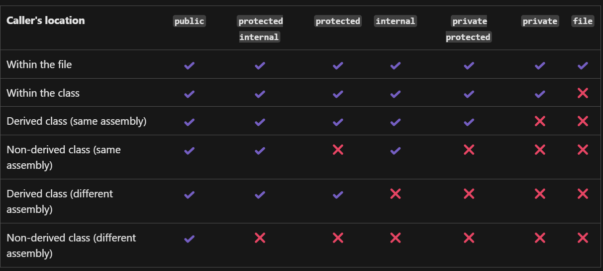

# 11 - Object oriented programming

A way to structure code, according to rules. Everything in the code is made as an object. Every object is separated from others.

When objects have been defined, they are put together to a whole (program)

## Four pillars of OOP

### 1. Encapsulation - To group information.
Make a model of something, group information related to the model.
### 2. Abstraction - To hide information.
High level of abstraction - a lot of the details of the code is hidden, for example in a method that is called upon.
Low level of abstraction - all of the details are seen. Every step of the way.
### 3. Inheritance - To share information
DRY - Don't repeat yourself
### 4. Polymorphism - Redefine information
The same thing can mean different things for different objects.

## Example

### Class
A definition of a data type. A model of how a given object works, it's properties and methods.

Encapsulation - all the properties, fields and methods.
Abstraction - Methods, we don't need to know how they work, we can just call upon them.
Inheritance - Make a animal class where cat class and bird class can share
Polymorphism - redefine for example how the subclasses talk();

#### Members
Properties, fields, methods et.c

#### Animal class - (Superclass) (Parent class)

| Properties       | Fields (Internal states) | Methods |
| ---------------- | ------------------------ | ------- |
| Name (String)    | Hungry: (Bool)           | Run();  |
| Weight: (Double) | Tired: (Bool)            | Talk(); |
| Color: (Color)   |                          |         |
#### Cat class - (Subclass) (Child class) Inherits from animal class

| Properties        | Fields | Methods |
| ----------------- | ------ | ------- |
| Has fur (Bool)    |        |         |
| Has 4 legs (Bool) |        |         |

#### Bird class - (Child class) Inherits from animal class

| Properties         | Fields | Methods |
| ------------------ | ------ | ------- |
| Has feather (Bool) |        |         |
| Has 2 legs (Bool)  |        |         |

### Object - Instances of the class
When you create for example a specific cat, or specific bird.

### Access modifier - [Access modifiers](https://learn.microsoft.com/en-us/dotnet/csharp/programming-guide/classes-and-structs/access-modifiers)
Define who can see what. All members have these.
1. Private - Only accessible to a specific part of the code.
2. Public - Accessible to all parts of the code. 
3. Protected
4. Internal



## Overloading

### Method overloading
Different version of a method. To be able to overload you have to either different amounts of parameters or different variable types.

A form of polymorphism.

Ex: Miaow(); , Miaow(int volume); , Miaow(double volume)

### Operator overloading
Used to define what the operators does. When defining a class we can define what the operators will do.

Ex:
1. 2 + 3 = 5
2. "abc" + "def" = "abcdef"
3. Cat object + Cat object = What happens?

## Code example

```c#
//Make object (new instance of Cat), myCat = reference to a object.
//Different ways to create object
Cat myCat = new Cat();
var myOtherCat = new Cat();
Cat myThirdCat = new();
//Reference to the object of myCat
Cat myThirdCat = myCat;
//Doesn't point to an object. Can store a reference to a object, but doesn't yet.
Cat myFifthCat = null;

//Define object field "name"
myCat.name = "Hampi";
myOtherCat.name = "Julki";
//Will change name of myCat, since myThirdCat is pointing to the same refrence.
myThirdCat.name = "Gugge";

//Define age
myCat.age = 5;
myOtherCat.age = 10;

//More convenient way of doing it
Cat myFourthCat = new Cat() { name = "Papi", age = 5 };

//Array of cat references
Cat[] cats = new Cat[] { myCat, myOtherCat, myThirdCat, myFourthCat };

foreach (Cat cat in cats)
{
    Console.WriteLine($"{cat.name} is {cat.age} years old");
}
//Call for methods of cat object 
foreach (Cat cat in cats)
{
    cat.Greet();
}
//Define class
class Cat
{
    public int age = 0;

    public string name = "Default name";

	public void Greet()
	{
    Console.WriteLine($"Hello, my name is {name}!");
	}
    //Method overloading
	public void Greet(string name)
	{
	    //This keyword - reference to the object that has called upon method
	    Console.WriteLine($"Hello {name}, my name is {this.name}!!!");
	}
	public void Greet(Cat cat)
	{
	    Console.WriteLine($"Hello {cat.name}, my name is {this.name}!!!");
	}
    public int GetDoubleAge()
    {
        return age * 2;
    }
}

```

### Composition
A way of organizing the code. Having objects referencing to each other.
