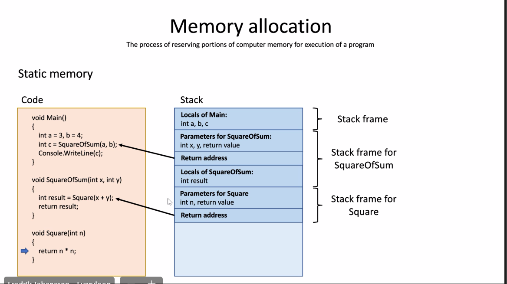

# 013. OOP - CTS, Memory allocation, Passing parameters, Struct, Enum

## Common type system and memory allocation in .Net

## Common type system (CTS)

Defines how types are declared, used and managed in the common language runtime.

**All types in .NET are either value types or reference types.

**Value types**: Data types whose objects are represented by the object's actual value. If an instance of a value type is assigned to a variable, that variable is given a fresh copy of the value.

int a = 5; (Writes a 5 in the memory spot that a represents)
int b = a; (Gives b a fresh copy of 5)

**Reference** types are data types whose objects are represented by a reference to the object's actual variable. If a reference type is assigned to a variable, that variable references (points to) the original value. No copy is made.

All types inherits (indirectly or directly) from System.Object class.
All value types inherits from System.ValueType class.


### Code example
```c#
//Value type: b is not changed by the new value of a, since b copies value from a.
int a = 5;
int b = a;
a = 3;
Console.WriteLine($"a = {a}, b = {b}"); //Output: {a} = 3, {b} = 5

//Reference type: catB name is changed by the new value of catA name, since catB
//is pointing to the same reference as catA.
Cat catA = new Cat() { name = "Miaow" };
Cat catB = catA;
catA.name = "Moo";
Console.WriteLine($"catA.name = {catA.name}, catB.name = {catB.name}"); 
//Output: {catA.name} = "Moo" {catB.name} = "Moo"

```
## Memory allocation
The process of reserving portions of computer memory for execution of a program.

Memory: RAM - Can be looked upon as a byte array where every byte has an adress(index) that can be read and written.

Only the OS has access to all the memory.
**Memory allocation**: The applications needs to ask the OS if they can have some memory for executing. After done: Deallocate - tells OS the memory isn't needed anymore.

### Static memory
Memory that is allocated when a program starts. Ex: Console app need 2 Mb memory, and gets just that, while the program is running. When done, the 2 Mb are deallocated.

When program is started:
Gives memory for the code, the **stack LIFO (Last in, first out)**
#### Stack frame 
All the memory that's needed for a method to execute


### Dynamic memory

During the execution of a program, the program asks OS for more memory (Dynamic memory) for reference types.
#### Heap
Dynamic memory is stored in a heap. Contrary to the stack, you can add and remove things in the heap in whatever order you want. 

When there's no reference to an object left the .NET garbage collector will remove it from the heap.


## Passing parameters
How arguments are sent to methods. Don't mix pass by value/reference with types. Both types can be either be passed by value or reference.

### Pass by value
Default way to pass parameters in C#. 
Creates a copy of the passed parameter that will be used in the called method. 
If the called method modifies the parameter, the value of the original variable in the calling method remains unchanged.  

When passing a value type, the value is copied to the parameter of called method. 
When passing a reference type, the reference to the instance of the type is copied to the parameter of the called method.
### Pass by reference
Only when the **ref** or **out** keywords are specified. 
Creates a reference to the passed parameter that will be used in the called method. 
If the called method modifies the parameter, the value of the original variable in the calling method will change as well.  

When passing a value type, a reference to the original variable is used in the called method,
When passing a reference type, a reference to the original reference is used in the called method.

### Code example
```c#
PassValueTypeByValue(a);
PassValueTypeByReference(ref a);
PassReferenceTypeByValue(catA);
PassReferenceTypeByReference(ref catA);

//Can't change value of value type
static void PassValueTypeByValue(int i)
{
    i = 0;
    
}
//Can change value of value type
static void PassValueTypeByReference(ref int i)
{
    i = 0;
}
//Can change members of Reference type
static void PassReferenceTypeByValue(Cat cat)
{
    //This works: cat.name = "Miaow";
    cat = new Cat() { name = "Miaow" };
}
//Can change the object reference of reference type
static void PassReferenceTypeByReference(ref Cat cat)
{
    cat = new Cat() { name = "Miaow" };
}
```

## Struct & Enum (enumeration)
Value types

### Struct
Works a lot like a class. The big difference: Struct = value type. Class = Reference type.
Shouldn't take a lot of memory.

Struct can have methods, properties, fields.
Struct can't inherit.

### Enum
Used to keep track of states.

### Code example
```c#
Position position = new Position(0, 0);

Console.WriteLine($"Player is at position {position.X}, {position.Y}");


Color myColor = Color.Red;

Console.WriteLine($"myColor = {myColor} ({(int)myColor})");
Console.WriteLine($"(Color)3 = {(Color)3}");

struct Position
{
    public int X;
    public int Y;

    public Position(int x, int y)
    {
        X = x;
        Y = y;
    }
}
enum Color { Red, Green, Blue, Yellow, Purple };
```

