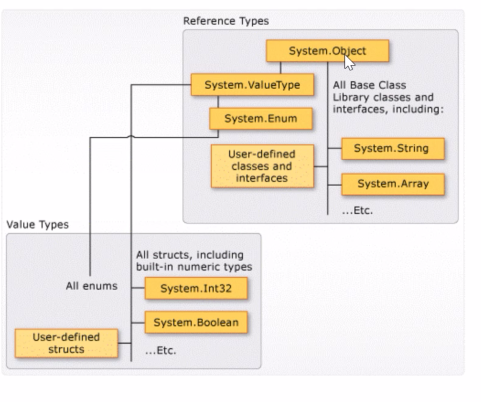

# 013. OOP - Value & Representation types

## Common type system and memory allocation in .Net

## Common type system (CTS)

Defines how types are declared, used and managed in the common language runtime.

**All types in .NET are either value types or reference types.

**Value types**: Data types whose objects are represented by the object's actual value. If an instance of a value type is assigned to a variable, that variable is given a fresh copy of the value.

int a = 5; (Writes a 5 in the memory spot that a represents)
int b = a; (Gives b a fresh copy of 5)

**Reference** types are data types whose objects are represented by a reference to the object's actual variable. If a reference type is assigned to a variable, that variable references (points to) the original value. No copy is made.

All types inherits (indirectly or directly) from System.Object class.
All value types inherits from System.ValueType class.

## Memory allocation
The process of reserving portions of computer memory for execution of a program.

Memory: RAM - Can be looked upon as a bytearray where every byte has an adress(index) that can be read and written.

Only the OS has access to all the memory.
**Memory allocation**: The applications needs to ask the OS if they can have some memory for executing. After done: Deallocate - tells OS the memory isn't needed anymore.

### Static memory
Memory that is allocated when a program starts. Ex: Console app need 2 Mb memory, and gets just that, while the program is running. When done, the 2 Mb are deallocated.

When program is started:
Gives memory for the code, the stack
#### Stack frame
All the memory that's needed for a method to execute

