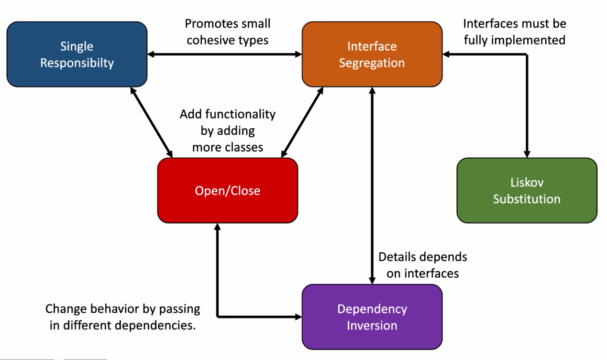
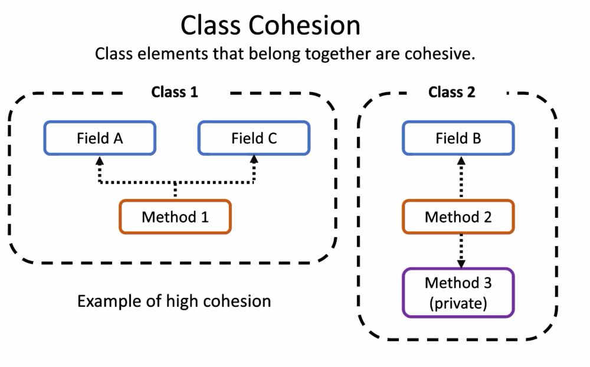

# 022. Clean code - Design principles


## What is clean code?

+ Clean code is easy to read. This method does this.
+ Code that is easy to scale, modular
+ Code that is reusable, modular. Classes should work separately
+ Code that doesn't break in unsuspected places
+ Methods without side effects

## What is dirty code? (Code smell)

+ Code that isn't clear. Methods with 1000 rows of code, that doesn't make sense
+ Code that is unnecessarily complex
+ Code that breaks in unsuspected ways
+ Code that does stuff it shouldn't do

## How to write clean code

### Naming is **Important!**
+ Choose variable name that describes it content
+ Choose method names that describe their task

### If you need to comment code to become readable. Rewrite the code so that it is understandable instead.

### It is better with lots of small functions and methods, instead of big unreadable functions and methods.


## Design principles - General guidelines

### DRY - Don't repeat yourself, think before copy-pasting

### KISS - Keep It Simple, Stupid. 
Think that an average coder should be able to fix your code.
### YAGNI - You Ain't Gonna Need It.
Don't build functionality before it's needed. "This mig be useful in the future". Optimization - make it clean instead of optimized, often times the program is fast enough. Optimize when you notice you need the optimization.
### SOLID - First letter of 5 different design principles

Is a set of design principles for OOP that minimize consequences of future changes of code. In practice it's about doing qualified guesses about how requirement specs for the software most probably could change in the future.

**Remember** - These are principles with their own pros and cons. Sometimes there can be conflicts between principles. When coding, coders can weigh pros and cons of different choices.
#### SRP - Singe Responsibility Principle
+ Every class/method should only have one single responsibility.
+ "A class should only have one reason to change."
+ "A method should do only one thing, with no side effects."
+ "Gather the things that change for the same reason. Separate those things that change for different reasons"
+ SRP is about evaluating how code in the best way is broken down in pieces and how to draw lines around encapsulation in code.
##### Separation of concerns
+ Applications should be broken down in delimited parts, where each part has a single responsibility.
+ **Tight Coupling** - Binds together two, or more, details in way that makes them hard to separate.
+ **Loose coupling** - A modular way of choosing which details are involved in a given operation.
+ **Class cohesion** - Class elements that belong together are cohesive.

#### OCP - Open/Closed Principle
+ "Software entities (classed, modules, functions)" should be open for new functionality but closed for moderating." - Bertrand Meyer
+ "You should be able to extend the behaviour of a system without having to modify that system." - Bob Martin 
+ OCP is about judging which parts of a system that should have concrete functionality (that you yourself implements), and which parts that are abstract constructions where the on who uses the system can build their own implementations
##### Weighing abstract and concrete
**Example of totally abstract and totally concrete.** You need to get a balance between these


#### LSP - Liskov Substitution Principle
Object of a subclass should be interchangeable with objects that it inherits from.
+ "Methods that use references to base classes must be able to use objects of derived classes without knowing it."
+ "A base type must be replaceable with any of its subtypes without breaking the functionality or logic of the program."
+ "Interfaces must be fully implemented". Interface in general in OOP - Data type, what things can i run from this data type?
+ This principle helps you avoid unexpected bugs and errors when writing application.
#### ISP - Interface Segregation Principle
+ "Clients shouldn't be forced to be dependent on methods that it doesn't use."
+ "Prefer small, cohesive interfaces, to large, expansive ones."
+ The problem with big interfaces are that every member must be implemented to not break LSP, even the ones we don't need.
#### DIP - Dependency Inversion Principle
Create classes that aren't dependent on other classes.
+ "High-level modules should not depend on low-level modules. Both should depend on abstractions"
+ "Abstractions should not depend on details. Details should depend on abstractions."
+ This principle helps you create loose coupling and modular structure, where the high-level code isn't directly dependent of details on low-level.

### SOLID code example
```C#
var dbReader = new DataBaseReader("192.168.0.1", "hoarseServer");
ShoppingCart databaseCart = new ShoppingCart(dbReader);

databaseCart.LoadProducts();
databaseCart.ShowProducts();

var fileReader = new FileReader("products.txt");
ShoppingCart fileCart = new ShoppingCart(fileReader);

fileCart.LoadProducts();
fileCart.ShowProducts();

class Product
{
    public Product(string name)
    {
        Name = name;
    }

    public string Name { get; set; }

}

class ShoppingCart
{
7.  private List<Product> products;
    private IReader reader;

7.  public ShoppingCart(IReader reader)
    {
        this.reader = reader;
    }
    public void ShowProducts()
    {
        products.ForEach(p => Console.WriteLine(p.Name));
    }
7.  public void LoadProducts()
    {
        products = reader.LoadProducts();
    }

3.  //Still hard coded what class is used while loading

    //public void LoadProducts()
    //{
    //    var reader = new DataBaseReader(); //New is glue.
    //    products = reader.LoadProducts();
    //}

2.  //Moved to databasereader class

1.  //public void LoadProducts()
    //{
    //    Console.WriteLine("Loading products from database");
    //    // Code that reads products from a database.Simulated

    //    products = new List<Product>();
    //    products.Add(new Product("database product A"));
    //    products.Add(new Product("database product B"));
    //}
}

class DataBaseReader : 5. IReader
{
    private string serverName;
    private string databaseName;

    public DataBaseReader(string serverName, string databaseName)
    {
        this.serverName = serverName;
        this.databaseName = databaseName;
    }

    public List<Product> LoadProducts()
    {
        Console.WriteLine($"Loading products from database {databaseName} on server {serverName}");
        // Code that reads products from a database.Simulated

        var products = new List<Product>();
        products.Add(new Product("database product A"));
        products.Add(new Product("database product B"));

        return products;
    }
}

6. class FileReader : IReader
{
    private string filePath;

    public FileReader(string filePath)
    {
        this.filePath = filePath;
    }

    public List<Product> LoadProducts()
    {
        Console.WriteLine($"Loading products from {filePath}");
        // Code that reads products from a file. Simulated

        var products = new List<Product>();
        products.Add(new Product("file product A"));
        products.Add(new Product("file product B"));
        products.Add(new Product("file product C"));

        return products;
    }
}

4. interface IReader
{
    public List<Product> LoadProducts();
}
```

## Design Patterns - Solutions for specific problems

### Factory Pattern
Create new objects without hard coding which type of object that should be created.
### Build Pattern
Construct complex object. Object with a lot of properties.
### Strategy Pattern
Bring to the table and choose different algorithms in runtime.
### Dependency Injections
Create loose dependencies between classes.